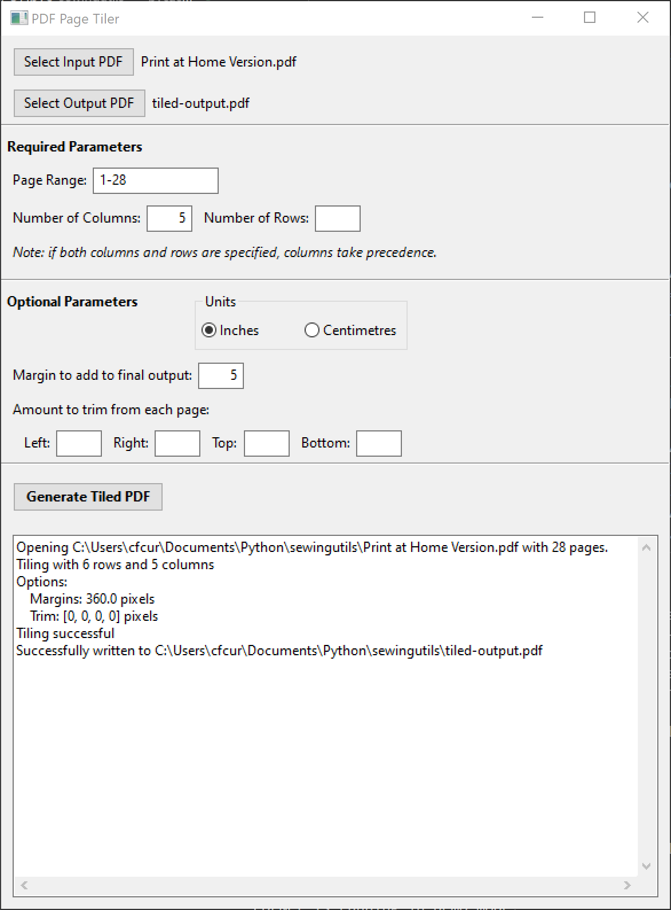

# sewingutils
Utilities for working with sewing patterns.

## PDF page tiling
Many sewing patterns are provided as print-at-home PDFs with pages suitable for printing on either 8.5x11 or A4 sized paper. The PDF page tiling utility takes these pages and assembles them into a single page PDF for use with projectors.

### Prerequisites
* [Python 3.5-3.8](https://www.python.org/downloads/) and `pip`. Testing was done with 64-bit Python 3.7.9 provided by [Anaconda](https://www.anaconda.com/) on Windows 10.

* [PDFTron SDK](https://www.pdftron.com/documentation/python/get-started/python3) Precombiled binary can be installed by running `pip install PDFNetPython3`

* [wxPython](https://www.wxpython.org/) (Optional, for GUI support). Testing was done with version 4.0.4 provided by `conda`.

### Command Line Usage
The script `tile_pages.py` can be called as followed:

    python tile_pages.py <options> input.pdf output.pdf

where `input.pdf` is the pattern file provided by the designer and `output.pdf` is the name of the output file to generate.

### GUI Usage
The gui can be launched by running `python sew_gui.py`. The following window should appear:

"Select Input PDF" launches a file browser allowing you to choose the print at home PDF. "Select Output PDF" launches a file browser to select the name of the document to write. If you don't specify a filename here, you will be asked to choose one when you click "Generate Tiled PDF".

So far the only difference between the GUI and the script version is the ability to specify units for the margin/trim options (inches or centimetres).

The GUI does not display the input or output PDF. You will need to use an external PDF viewer such as Adobe Reader for this. Remember to close your output PDF if you want to re-generate with different options, otherwise it will be locked for writing.

### Optional arguments
`-p PAGES, --pages PAGES`: Pages to tile. May be range or list (e.g. 1-5 or 1,3,5-7, etc). If no pages are specified, the entire document is tiled. Pages may be repeated and blank pages can be inserted using zeros.

`-r ROWS, --rows ROWS`:  Number of rows in tiled grid.

`-c COLUMNS, --columns COLUMNS`: Number of columns in tiled grid. Note that while rows/columns are technically optional arguments, one should be defined to generate useful results, otherwise the script will tile as close to a square as possible (e.g. 25 pages will result in a 5x5 grid). If both are defined, the rows are ignored.

`-m MARGINS, --margins MARGINS`: Margin size in inches. Adding a margin can be very useful for projecting patterns as it allows for greater flexibility in positioning the pattern piece within the projected area.

`-t TRIM, --trim TRIM`  Amount to trim from edges given as left,right,top,bottom (e.g. 0.5,0,0.5,0 would trim half an inch from left and top). Tip: use the "measure" tool in Adobe Reader DC to determine the amount to trim.

### Examples
    python tile_pages.py -c 5 -m 10 input.pdf output.pdf 
Simple example for no-trim pages where the entire document contains pattern pieces (no instructions or title page). The options specified here result in 5 columns and 10" margins.

    python tile_pages.py -r 3 -p 33-44,0,0,45-51 input.pdf output.pdf
More complicated example with 3 rows of pages. Pattern pieces are only on pages 33-51, but the assembly diagram has two pages missing from the middle row, so two zeros are inserted into the page list.

    python tile_pages.py -c 2 -p 5,7,6,8-10,0,11-16 -t 0,1.4,1.4,0 input.pdf output.pdf
Yet more complication. This pattern has somewhat unusual assembly instructions as the pieces are designed to be split across two pages each, not assembled into one large grid. The workaround is to to give the pages left to right then top to bottom order. In addition, 1.4" is trimmed from the right and top of each page.
