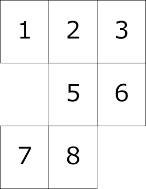

# PDFStitcher
This is a utility for stitching together many PDF pages from a single document into one single page. This is also called "N-Up" or page imposition. This utility was created in order to convert sewing patterns into a convenient format for projecting, though it could be used to stitch together any PDF.

## Download the latest release
* [Windows (64-bit Windows 7 or 10)](https://github.com/cfcurtis/sewingutils/releases/download/v0.3-alpha/pdfstitcher.exe)
* [MacOs (Catalina or higher)](https://github.com/cfcurtis/sewingutils/releases/download/v0.3-alpha/pdfstitcher.app.zip)

Previous versions can be found by clicking on the "releases" link to the right.

## Features
* Stitch together pages in any order with specified number of rows or columns
* Layers are automatically preserved if present in the source document
* Rotate pages before stitching
* Add blank pages by including zeros in the page list (e.g. 1-5,0,6-10)
* Add margins around the final output
* Trim the edges of each page by a specified amount

## Installation
Most people probably want to just use the executable links above. However, if you want to run the script directly, you'll need the following:

* [Python 3.6+](https://www.python.org/downloads/) and `pip`. Testing was done with 64-bit Python 3.9.0 provided by [Anaconda](https://www.anaconda.com/) on Windows 10 and Python 3.9.1 provided by [homebrew](https://brew.sh/) on macOS Catalina 10.15.7.

* [pikepdf](https://github.com/pikepdf/pikepdf) - can be installed by running `pip install pikepdf`

* [wxPython](https://www.wxpython.org/) - can be installed by running `pip install wxpython`

## Usage

"Select input PDF" launches a file browser allowing you to choose the print at home PDF. "Save output as" launches a file browser to select the name of the document to write. If you don't specify a filename here, you will be asked to choose one when you click "Generate Tiled PDF". By default, the page range box will include all the pages in the document. The other required field is the number of rows or columns defining your desired grid. You can specify both, but if they don't agree with the number of pages, the columns field takes precendence (for example if you have 20 pages and request 3 columns and 5 rows, it will tile with 3 columns and 7 rows in order to fit all 20 pages).

The test document "testdoc.pdf" is a simple 20 page document with one label per page representing rows 1-5 and columns A-D (A1, A2, A3, A4, B1, B2, B3, B4, etc). The following images show the original PDF and the tiled output generated with the options above.

## Fancy stuff
Some PDFs require trimming pages, assembling with gaps, tiling with columns first, etc. The following options allow for *most* patterns to be assembled.
* Page range: this field can take arbitrary ranges (e.g. 3-10), a comma separated list, or a combination (e.g. 3-10, 4, 11-12). Page repetition is allowed, and adding a "0" inserts a blank page. The following example would be constructed by specifying 3 columns and/or 3 rows and the page range `1-4,0,5-6,0,7-8`

* Page order: most PDFs are assembled row by row, left to right, top to bottom. The page order options allow for columns first, right to left, or bottom to top, in any combination.

* Rotation: The pages can be rotated either clockwise or counterclockwise prior to assembly. Note that when rotation is enabled, the trim values (left/right/top/bottom) refer to the original non-rotated page.

## Not yet supported
* Different trim for each page
* Extraction or modification of layers
* Mixed size or orientation of pages

At this time, the GUI does not display the input or output PDF. You will need to use an external PDF viewer such as Adobe Reader for this. Remember to close your output PDF if you want to re-generate with different options, otherwise it will be locked for writing.

## Help!
Found a bug, or have an idea for a great new feature? Check out the [Issues](https://github.com/cfcurtis/sewingutils/issues) tab to see if it's an open issue, or submit a new one if it's not on the list.
